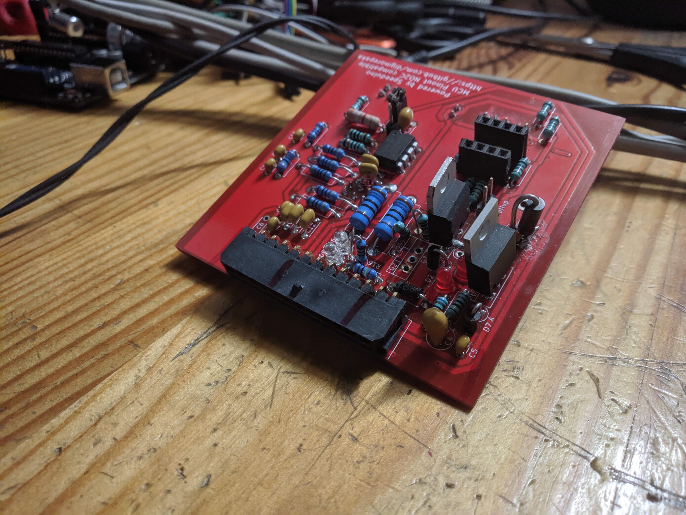

# Features
* 75x78mm form factor
* 2 Injection channels (High-Z negative side switching)
* 2 Ignition channels (5V/12V)
* Up to 2 cylinder sequential, up to 4 cylinder paired mode
* Tacho output
* 1 Programable output
* Secondary serial
* Speeduino firmware

# Use cases
* Motorcycles
* ATVs
* Go karts
* Other small form factor installations

